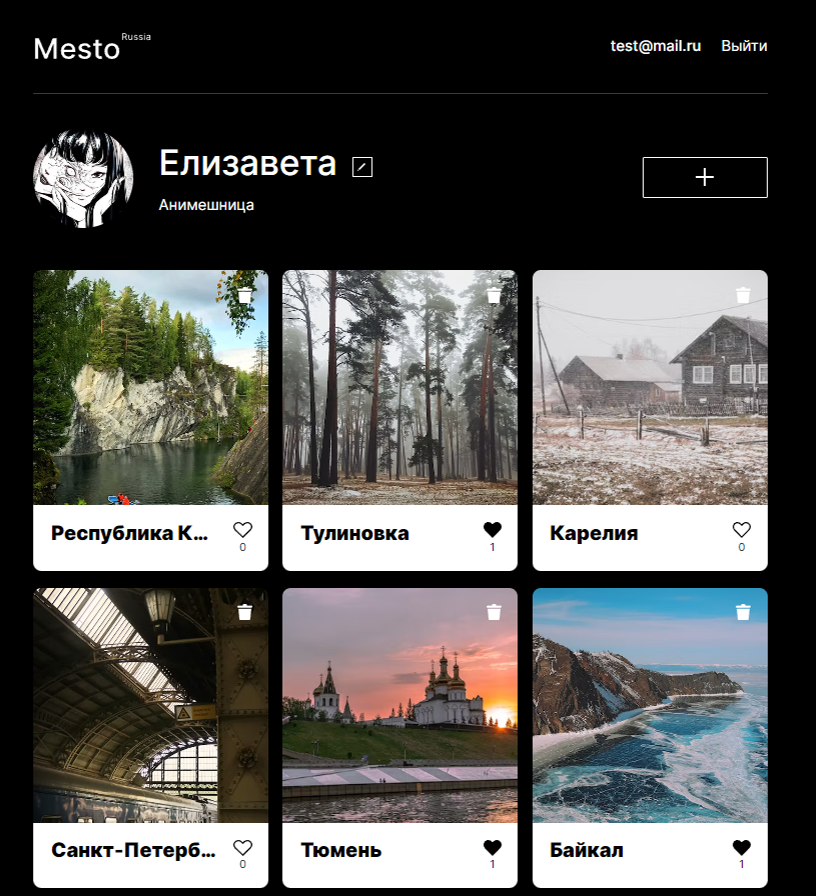
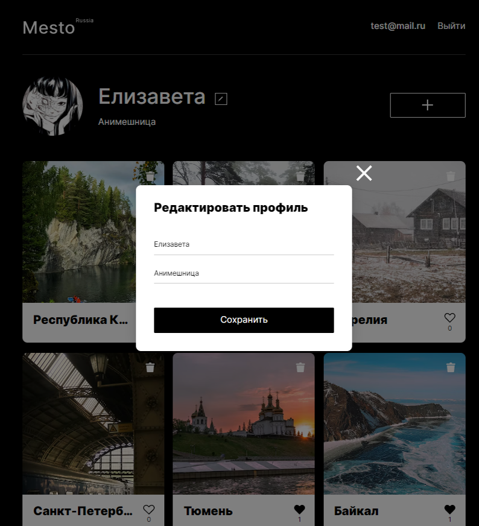
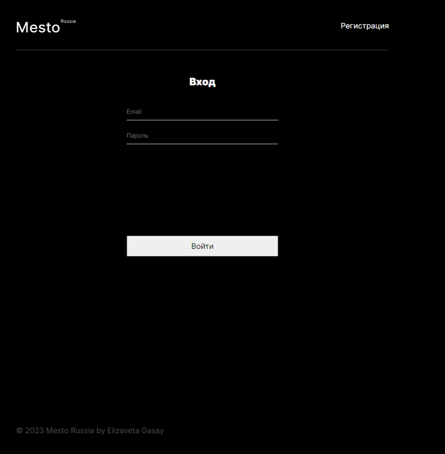

# react-mesto-api-full
Репозиторий для приложения проекта `Mesto`, включающий фронтенд и бэкенд части приложения со следующими возможностями: авторизации и регистрации пользователей, операции с карточками и пользователями. Бэкенд расположите в директории `backend/`, а фронтенд - в `frontend/`. 

Адрес репозитория: https://github.com/Gasay-Liza/react-mesto-api-full-gha

## Ссылки на проект

IP-адрес 158.160.25.243

Frontend https://gasayliza.nomoredomains.monster

Backend https://api.gasayliza.nomoredomains.monster

## Скриншоты

## Функционал:
### Фронтенд:
* Редактирование профиля (имя, о себе, аватар)
* Добавление карточек с фотографией и названием мест
* Возможность ставить/снимать лайки
* Возможность удалять только свои карточки мест
* Регистрация и авторизация
### Бэкенд (API):
* Регистрация и авторизация пользователя
* Получение данных авторизованного пользователя
* Запрос изменения авторизованного пользователя
* Получение данных пользователя по id
* Выдача и проверка jwt-токена
* Получение списка карточек мест
* Добавление новой карточки места
* Установка и снятие лайка на карточках
* Удаление карточек только авторизованного пользователя

## Технологии

* __Flexbox__
* __Grid__
* __SASS__
* Методология __БЭМ__
* __Семантическая__ вёрстка
* __Адаптивность__ с использованием "резиновости"
* __React__ технологии
  * хуки: useState, useEffect
  * кастомный хук: useInput для валидации форм
  * функциональные компоненты
  * React Router (v. 5.2.1)
  * Context

## Установка

Установить Node.js и запустить в корневом каталоге проекта:

*  `npm install`

**Скрипты**

Backend:
* `cd .\react-mesto-api-full\backend` - вход в каталог
* `npm i` - установка зависимостей
* `mongod` - запуск mongodDB
* `npm run dev` - запуск develop-сборки с hot-reload

Frontend:
* `cd .\frontend` - вход в каталог
* `npm i` - установка зависимостей
* `npm run start` - запуск develop-сборки с hot-reload

## Роуты

| Роут | Запрос | Действие | Ошибки |
| --- | --- | --- | --- |
| `/users` | GET POST | GET-запрос возвращает всех пользователей из базы данных; POST-запрос создаёт пользователя с переданными в теле запроса name, about, avatar | 400 — Переданы некорректные данные при создании пользователя. 500 — Ошибка по умолчанию. |
| `/users/:userId` | GET | GET-запрос возвращает пользователя по переданному _id. | 404 — Пользователь по указанному _id не найден. 500 — Ошибка по умолчанию. |
| `/users/me` | PATCH | PATCH-запрос обновляет информацию о пользователе. | 400 — Переданы некорректные данные при обновлении профиля. 404 — Пользователь с указанным _id не найден. 500 — Ошибка по умолчанию. |
| `/users/me/avatar` | PATCH | PATCH-запрос обновляет аватар пользователя. | 400 — Переданы некорректные данные при обновлении аватара. 404 — Пользователь с указанным _id не найден. 500 — Ошибка по умолчанию. |
| `/cards` | GET POST | GET-запрос возвращает все карточки из базы данных. POST-запрос создает новую карточку по переданным параметрам. | 400 — Переданы некорректные данные при создании карточки. 500 — Ошибка по умолчанию. |
| `/cards/:cardId` | DELETE | DELETE-запрос удаляет карточку по _id. | 404 — Карточка с указанным _id не найдена. |
| `/cards/:cardId/likes` | PUT DELETE | PUT-запрос добавляет лайк карточке. DELETE-запрос удаляет лайк с карточки. | 400 — Переданы некорректные данные для постановки/снятии лайка. 404 — Передан несуществующий _id карточки. 500 — Ошибка по умолчанию. |

## Директории

`/routes` — папка с файлами роутера  
`/controllers` — папка с файлами контроллеров пользователя и карточки   
`/models` — папка с файлами описания схем пользователя и карточки  
`/middlewares` — папка с файлами промежуточных функций  
`/errors` — папка с файлами кастомных ошибок
